# All-in-one-Databricks-deployment

# Introduction to this Guide

This guide is meant to help define the architecture needed for our Azure and AWS Databricks deployments. This week, we’re focusing heavily and writing the code needed to get these systems deployed to Azure and AWS. This guide will focus on creating a minimal architecture needed to securely support Databricks.

# AWS Plan

### Project Overview

**Objective**: We've structured a robust Pulumi-based infrastructure-as-code (IaC) project aimed at deploying and managing a comprehensive suite of AWS resources. This setup ensures that our infrastructure is not only scalable and maintainable but also adheres to best practices in security, compliance, and efficient cloud resource management.

**Configuration Management**: We have established a systematic approach to managing configurations through YAML files. These files, differentiated by environment (dev, test, prod), contain all necessary parameters to instantiate resources across our AWS environment.

**DTO Implementation**: We've designed a comprehensive Data Transfer Object (DTO) system in `dto.py` that encapsulates all configurations for our resources. This setup aids in passing configuration data seamlessly between different modules and functions, enhancing modularity and reducing coupling.

**Resource Modules**:

1. **IAM**: Manages AWS IAM roles and policies ensuring that access control is tightly governed across our services.
2. **VPC**: Configures all aspects of the network including subnets, route tables, and internet gateways, ensuring isolated and secure network operations.
3. **Security**: Sets up security groups and network ACLs to enforce firewall rules and safeguard our resources.
4. **Storage**: Handles S3 bucket creation, setup for encrypted storage, and ensures data integrity.
5. **Databricks**: Deploys and manages AWS Databricks workspaces, facilitating big data processing and analytics.
6. **PrivateLink**: Ensures secure, private connectivity between our services and external services without exposure to the public internet.
7. **KMS**: Manages encryption keys, providing necessary data security measures for compliance and data protection.
8. **Monitoring**: Implements logging and monitoring using AWS CloudTrail and CloudWatch, crucial for operational visibility and auditing.
9. **Bastion**: Establishes a secure bastion host for safely accessing our internal networks.
10. **Connectivity**: Manages VPC peering and transit gateways to support efficient and secure cross-network connections.
11. **Compliance**: Ensures all resources adhere to organizational and regulatory compliance requirements, with automated checks and documentation.

**Deployment Strategy**:

- We use `__main__.py` as the central orchestrator that initializes resource deployment based on the loaded configuration. This script also handles output management, ensuring visibility and traceability of resource states.

**Documentation**:

- Each module and configuration step is well-documented, ensuring that team members can easily understand and interact with the system. Furthermore, the project setup supports easy updates and maintenance, catering to future infrastructure needs and modifications.

**Future Proofing**:

- Our architecture is designed with scalability and extensibility in mind, allowing for easy integration of additional AWS services or adjustments to existing configurations without extensive overhauls.

### Next Steps

- **Review and Testing**: The team is encouraged to review the current configurations and test the deployment scripts in a controlled environment.
- **Feedback Loop**: Collect feedback to refine and improve the setup.
- **Continuous Integration/Continuous Deployment (CI/CD)**: Implement CI/CD pipelines to automate the deployment and management processes further.

### **Project Structure**

Here’s our project structure incorporating the unified DTO approach for configuration management in a Pulumi project. This structure is designed to support a scalable and maintainable deployment process, accommodating the complexities of managing various AWS resources with a single configuration DTO.

### Updated Project Structure

```
/my-pulumi-project
│
├── infra/
│   ├── __main__.py               # Entry point for Pulumi, orchestrates the resource deployment using the unified DTO
│   ├── Pulumi.yaml               # Project metadata and Pulumi settings
│   ├── config/                   # Environment specific configurations
│   │   ├── dev.yml               # Development environment configuration
│   │   ├── test.yml              # Testing environment configuration
│   │   ├── prod.yml              # Production environment configuration
│   │
│   ├── dto.py                    # Defines the unified DTO class and its nested classes for resource configurations
│   ├── resources/                # Resource modules, each utilizing the unified DTO for configurations
│   │   ├── iam.py                # IAM roles and policies setup
│   │   ├── vpc.py                # VPC and networking resources
│   │   ├── security.py           # Security groups and network ACLs
│   │   ├── storage.py            # S3 buckets configuration
│   │   ├── databricks.py         # Databricks workspace deployment
│   │   ├── privatelink.py        # PrivateLink configuration
│   │   ├── kms.py                # KMS resources for key management
│   │   ├── monitoring.py         # CloudTrail and CloudWatch setup
│   │   ├── bastion.py            # Bastion host setup for secure access
│   │   ├── connectivity.py       # VPC peering or transit gateway resources
│   │   ├── compliance.py         # Compliance and documentation tools
│   │
└── README.md                     # Project overview and setup instructions

```

### Documentation of Project Components

- **`__main__.py`**: This is the primary script where Pulumi begins the resource deployment process. It loads the environment-specific configuration from the YAML files, constructs the unified DTO, and passes it to each resource module.
- **`Pulumi.yaml`**: Contains metadata about the Pulumi project, including the project name and runtime (Python in this case).
- **`config/`**:
  - **`dev.yml`, `test.yml`, `prod.yml`**: These files store environment-specific configurations that include details such as resource names, sizing, tags, and other settings relevant to each deployment stage.
- **`dto.py`**: Defines the `ConfigDTO` class which includes nested classes for each type of resource configuration. This module centralizes the definition of data structures that represent the configuration state of all resources.
- **`resources/`**:
  - **Resource Modules (`iam.py`, `vpc.py`, `storage.py`, etc.)**: Each Python module within the `resources` directory is responsible for deploying a specific type of AWS resource. Modules utilize the `ConfigDTO` from `dto.py` to access configuration data in a structured manner, enhancing maintainability and ensuring consistency across resource deployments.
- **`README.md`**: Provides a comprehensive overview of the project, including how to set up and run deployments, structure explanations, and additional notes on managing and extending the project.

### Advantages of This Structure

- **Centralized Configuration Management**: By using a unified DTO, the project simplifies the management of configurations, reducing duplication and potential errors.
- **Scalability**: New AWS services or resources can be added by simply extending the `ConfigDTO` and adding corresponding resource modules.
- **Maintainability**: Each resource module handles a specific part of the AWS infrastructure, making the codebase easier to understand and maintain.
- **Flexibility**: Environment-specific configuration files allow for customized deployments without altering the core logic of resource modules.

This structure is designed to be robust and flexible, catering to complex deployments while maintaining simplicity and readability. It supports future enhancements and integrations by keeping the configuration logic separate from the deployment logic, aligned with best practices in software development.

## Each Resource & Main

In the next section, we will examine each resource and its relationship to Main. Primarily, `__main__.py` acts as the chief orchestrator, managing resource dependency and configuration for specific resource objects. We're using a pattern that employs a data object or DTO to hold configuration data. As the project heavily relies on configuration, this small amount of coding overhead should enhance our development flexibility.

## IAM

### 1. YAML Configuration for IAM

Here's how the IAM configuration might appear in one of the `config/*.yml` files. This includes inputs for creating IAM roles and policies:

```yaml
iam:
  roles:
    - name: DatabricksIAMRole
      assume_role_policy: |
        {
          "Version": "2012-10-17",
          "Statement": [
            {
              "Effect": "Allow",
              "Principal": {"Service": "ec2.amazonaws.com"},
              "Action": "sts:AssumeRole"
            }
          ]
        }
      policies:
        - arn: "arn:aws:iam::aws:policy/AmazonS3FullAccess"
        - arn: "arn:aws:iam::aws:policy/AmazonEC2FullAccess"
  outputs:
    role_arns: []
```

### 2. DTO Class Definition for IAM

This section of the `dto.py` file defines data classes for storing IAM configuration and outputs.

```python
# dto.py
from dataclasses import dataclass, field
from typing import List, Dict

@dataclass
class IAMRoleConfig:
    name: str
    assume_role_policy: str
    policies: List[str]

@dataclass
class IAMConfigDTO:
    roles: List[IAMRoleConfig]
    outputs: Dict[str, List[str]] = field(default_factory=dict)

    @staticmethod
    def from_dict(config: dict) -> 'IAMConfigDTO':
        roles = [IAMRoleConfig(**role) for role in config['roles']]
        outputs = config.get('outputs', {})
        return IAMConfigDTO(roles=roles, outputs=outputs)

```

### 3. IAM Resource Class

This Python class represents the IAM resource setup. It accepts the IAM configuration DTO, creates the necessary resources, and updates the DTO with output values.

```python
# resources/iam.py
import pulumi_aws as aws
from dto import IAMConfigDTO

class IAMResource:
    def __init__(self, config: IAMConfigDTO):
        self.config = config
        self.setup_roles()

    def setup_roles(self):
        for role in self.config.roles:
            iam_role = aws.iam.Role(
                role.name,
                assume_role_policy=role.assume_role_policy
            )
            for policy_arn in role.policies:
                aws.iam.RolePolicyAttachment(
                    f"{role.name}-{policy_arn.split('/')[-1]}",
                    role=iam_role.name,
                    policy_arn=policy_arn
                )
            # Capture the ARN of the created role in the DTO
            if 'role_arns' not in self.config.outputs:
                self.config.outputs['role_arns'] = []
            self.config.outputs['role_arns'].append(iam_role.arn)

    def output_dto(self) -> IAMConfigDTO:
        return self.config

```

### Mermaid Diagram: Flow of IAM Resource Creation

Here’s a simple flowchart describing the process of creating IAM resources using the DTO, including interaction points:

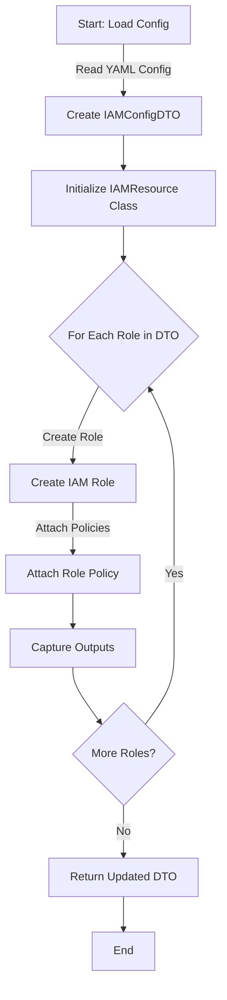

This approach ensures a highly modular, maintainable, and scalable deployment of IAM resources in an AWS environment using Pulumi with Python, adhering to best practices in software development.

## VPC.py

Let's address the VPC resource within the Pulumi-based infrastructure project by detailing configuration values, updating the DTO structure, outlining the Python class that handles VPC resource creation, and providing a flowchart diagram to illustrate the process.

### 1. YAML Configuration for VPC

The VPC configuration in a YAML file would include details about the VPC, subnets, internet gateways, and any route tables or security settings. Here’s an example of how these configurations might be structured:

```yaml
vpc:
  name: main
  cidr_block: "10.0.0.0/16"
  subnets:
    - name: public-subnet
      cidr_block: "10.0.1.0/24"
      availability_zone: "us-east-1a"
      map_public_ip_on_launch: true
  internet_gateway: true
  nat_gateways:
    - subnet_name: public-subnet
  outputs:
    vpc_id: ""
    subnet_ids: []
```

### 2. DTO Class Definition for VPC

Now, let's update the `dto.py` file to include a class for the VPC configuration, reflecting the structure given in the YAML file:

```python
# dto.py
from dataclasses import dataclass, field
from typing import List, Dict, Optional

@dataclass
class SubnetConfig:
    name: str
    cidr_block: str
    availability_zone: str
    map_public_ip_on_launch: bool

@dataclass
class VPCConfigDTO:
    name: str
    cidr_block: str
    subnets: List[SubnetConfig]
    internet_gateway: bool
    nat_gateways: List[Dict[str, str]]
    outputs: Dict[str, List[str]] = field(default_factory=dict)

    @staticmethod
    def from_dict(config: dict) -> 'VPCConfigDTO':
        subnets = [SubnetConfig(**subnet) for subnet in config['subnets']]
        nat_gateways = config.get('nat_gateways', [])
        return VPCConfigDTO(
            name=config['name'],
            cidr_block=config['cidr_block'],
            subnets=subnets,
            internet_gateway=config['internet_gateway'],
            nat_gateways=nat_gateways,
            outputs=config.get('outputs', {})
        )

```

### 3. VPC Resource Class

This Python class manages the creation of VPC resources using the provided DTO. It sets up the VPC, subnets, and related networking resources.

```python
# resources/vpc.py
import pulumi_aws as aws
from dto import VPCConfigDTO

class VPCResource:
    def __init__(self, config: VPCConfigDTO):
        self.config = config
        self.setup_vpc()

    def setup_vpc(self):
        vpc = aws.ec2.Vpc(self.config.name, cidr_block=self.config.cidr_block)

        if self.config.internet_gateway:
            ig = aws.ec2.InternetGateway(f"{self.config.name}-ig", vpc_id=vpc.id)

        subnet_ids = []
        for subnet in self.config.subnets:
            sn = aws.ec2.Subnet(
                f"{subnet.name}-{self.config.name}",
                vpc_id=vpc.id,
                cidr_block=subnet.cidr_block,
                availability_zone=subnet.availability_zone,
                map_public_ip_on_launch=subnet.map_public_ip_on_launch
            )
            subnet_ids.append(sn.id)

        # Store outputs
        self.config.outputs['vpc_id'] = vpc.id
        self.config.outputs['subnet_ids'] = subnet_ids

    def output_dto(self) -> VPCConfigDTO:
        return self.config

```

### Mermaid Diagram: Flow of VPC Resource Creation

Here's a Mermaid diagram describing the process of creating VPC resources using the DTO:

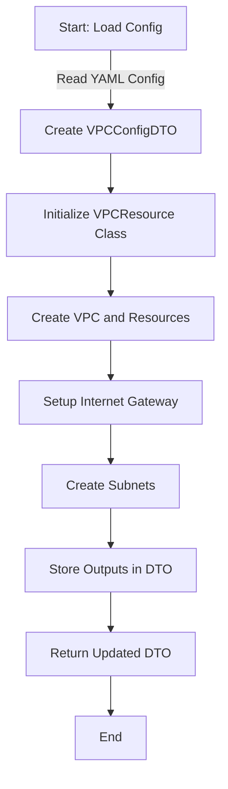

This setup ensures a cohesive and organized approach to managing AWS VPC configurations using Pulumi, adhering to software development best practices with clear separation of concerns and robust data management.

## security.py

For the security module (`security.py`) in our Pulumi project, we will cover the setup of Security Groups and Network ACLs, essential for defining the firewall rules at the instance and subnet level, respectively. Here's how we can structure the configuration, DTO class, resource class, and illustrate the process via a flowchart.

### 1. YAML Configuration for Security Settings

Here's an example of how the security configurations could be structured in a `config/*.yml` file:

```yaml
security:
  security_groups:
    - name: web-server-sg
      description: "Security group for web servers"
      vpc_id: "${vpc_id}" # This will be populated dynamically
      ingress:
        - protocol: "tcp"
          from_port: 80
          to_port: 80
          cidr_blocks: ["0.0.0.0/0"]
      egress:
        - protocol: "-1"
          from_port: 0
          to_port: 0
          cidr_blocks: ["0.0.0.0/0"]
  network_acls:
    - name: web-acl
      vpc_id: "${vpc_id}" # This will be populated dynamically
      ingress:
        - rule_number: 100
          protocol: "tcp"
          rule_action: "allow"
          cidr_block: "0.0.0.0/0"
          from_port: 80
          to_port: 80
      egress:
        - rule_number: 100
          protocol: "-1"
          rule_action: "allow"
          cidr_block: "0.0.0.0/0"
          from_port: 0
          to_port: 0
  outputs:
    security_group_ids: []
    network_acl_ids: []
```

### 2. DTO Class Definition for Security

```python
# dto.py
from dataclasses import dataclass, field
from typing import List, Dict

@dataclass
class IngressEgressRule:
    protocol: str
    from_port: int
    to_port: int
    cidr_blocks: List[str]

@dataclass
class SecurityGroupConfig:
    name: str
    description: str
    vpc_id: str
    ingress: List[IngressEgressRule]
    egress: List[IngressEgressRule]

@dataclass
class NetworkAclRule:
    rule_number: int
    protocol: str
    rule_action: str
    cidr_block: str
    from_port: int
    to_port: int

@dataclass
class NetworkAclConfig:
    name: str
    vpc_id: str
    ingress: List[NetworkAclRule]
    egress: List[NetworkAclRule]

@dataclass
class SecurityConfigDTO:
    security_groups: List[SecurityGroupConfig]
    network_acls: List[NetworkAclConfig]
    outputs: Dict[str, List[str]] = field(default_factory=dict)

```

### 3. Security Resource Class

```python
# resources/security.py
import pulumi_aws as aws
from dto import SecurityConfigDTO

class SecurityResource:
    def __init__(self, config: SecurityConfigDTO):
        self.config = config
        self.setup_security_groups()
        self.setup_network_acls()

    def setup_security_groups(self):
        for sg in self.config.security_groups:
            group = aws.ec2.SecurityGroup(
                sg.name,
                description=sg.description,
                vpc_id=sg.vpc_id,
                ingress=sg.ingress,
                egress=sg.egress
            )
            if 'security_group_ids' not in self.config.outputs:
                self.config.outputs['security_group_ids'] = []
            self.config.outputs['security_group_ids'].append(group.id)

    def setup_network_acls(self):
        for acl in self.config.network_acls:
            nacl = aws.ec2.NetworkAcl(
                acl.name,
                vpc_id=acl.vpc_id,
                ingress=acl.ingress,
                egress=acl.egress
            )
            if 'network_acl_ids' not in self.config.outputs:
                self.config.outputs['network_acl_ids'] = []
            self.config.outputs['network_acl_ids'].append(nacl.id)

    def output_dto(self) -> SecurityConfigDTO:
        return self.config

```

### Mermaid Diagram: Flow of Security Resource Creation

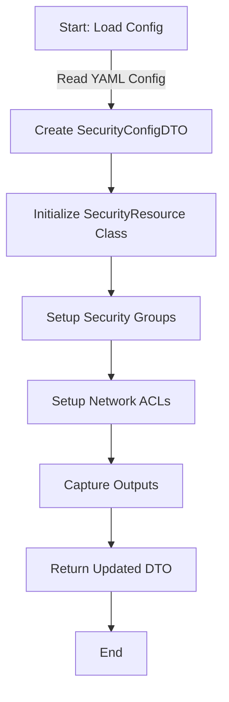

This structured approach helps ensure the security aspects of the AWS infrastructure are managed effectively within the Pulumi framework, maintaining a clear separation of concerns and scalability.

## Storage.py

Continuing with our project setup, let's address the `storage.py` module, focusing on Amazon S3 buckets. I'll define the necessary configurations in the YAML file, update the DTO structure, provide the corresponding Python class for managing S3 resources, and illustrate the entire process with a Mermaid diagram.

### 1. YAML Configuration for S3 Storage

The YAML configuration for the S3 buckets might include specifications for bucket creation, access policies, and encryption settings. Here’s a sample configuration:

```yaml
storage:
  s3_buckets:
    - name: myapp-dev-data
      region: us-east-1
      public_access_block: true
      versioning: true
      logging:
        target_bucket: myapp-log-bucket
        target_prefix: logs/dev/
      server_side_encryption: AES256
  outputs:
    bucket_arns: []
    bucket_names: []
```

### 2. DTO Class Definition for Storage

Let's define the DTO for the storage configuration, including properties for the S3 bucket and possible outputs.

```python
# dto.py
from dataclasses import dataclass, field
from typing import List, Dict, Optional

@dataclass
class S3BucketConfig:
    name: str
    region: str
    public_access_block: bool
    versioning: bool
    logging: Optional[Dict[str, str]]
    server_side_encryption: str

@dataclass
class StorageConfigDTO:
    s3_buckets: List[S3BucketConfig]
    outputs: Dict[str, List[str]] = field(default_factory=dict)

    @staticmethod
    def from_dict(config: dict) -> 'StorageConfigDTO':
        buckets = [S3BucketConfig(**bucket) for bucket in config['s3_buckets']]
        outputs = config.get('outputs', {})
        return StorageConfigDTO(s3_buckets=buckets, outputs=outputs)

```

### 3. S3 Bucket Resource Class

This class manages the S3 bucket creation and updates using the DTO. It initializes S3 resources and captures output details such as ARNs and names.

```python
# resources/storage.py
import pulumi_aws as aws
from dto import StorageConfigDTO

class S3Resource:
    def __init__(self, config: StorageConfigDTO):
        self.config = config
        self.create_buckets()

    def create_buckets(self):
        for bucket_config in self.config.s3_buckets:
            bucket = aws.s3.Bucket(
                bucket_config.name,
                acl="private",
                tags={"Environment": "dev"},
                versioning=aws.s3.BucketVersioningArgs(
                    enabled=bucket_config.versioning
                ),
                server_side_encryption_configuration=aws.s3.BucketServerSideEncryptionConfigurationArgs(
                    rule=aws.s3.BucketServerSideEncryptionConfigurationRuleArgs(
                        apply_server_side_encryption_by_default=aws.s3.BucketServerSideEncryptionConfigurationRuleApplyServerSideEncryptionByDefaultArgs(
                            sse_algorithm=bucket_config.server_side_encryption
                        )
                    )
                )
            )
            # Optionally set up logging
            if bucket_config.logging:
                aws.s3.BucketLogging(
                    f"{bucket_config.name}-logging",
                    bucket=bucket.id,
                    target_bucket=bucket_config.logging['target_bucket'],
                    target_prefix=bucket_config.logging['target_prefix']
                )
            # Store outputs
            if 'bucket_arns' not in self.config.outputs:
                self.config.outputs['bucket_arns'] = []
            if 'bucket_names' not in self.config.outputs:
                self.config.outputs['bucket_names'] = []
            self.config.outputs['bucket_arns'].append(bucket.arn)
            self.config.outputs['bucket_names'].append(bucket.id)

    def output_dto(self) -> StorageConfigDTO:
        return self.config

```

### Mermaid Diagram: Flow of S3 Bucket Resource Creation

Here's a simple flowchart describing the S3 bucket creation process using the DTO:

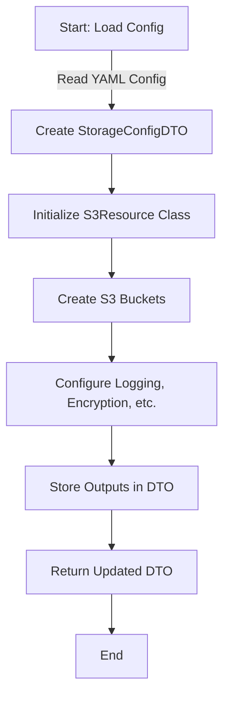

This setup outlines a clear and maintainable approach to managing S3 resources within a Pulumi project, ensuring configurations are effectively managed and resources are systematically deployed.

## Databricks.py

Continuing with the `databricks.py` module, let's focus on the setup for deploying a Databricks workspace on AWS, utilizing Pulumi. This setup will include the necessary YAML configuration, DTO updates, and the Python class to manage the deployment.

### 1. YAML Configuration for Databricks

Here's a YAML configuration example for a Databricks workspace. It details the necessary parameters and potential outputs.

```yaml
databricks:
  workspace:
    name: my-databricks-workspace
    region: us-west-2
    sku: "standard"
    managed_resource_group_id: "managed-rg"
    network:
      vpc_id: "${vpc_id}"
      subnet_ids: ["${subnet1_id}", "${subnet2_id}"]
      security_group_ids: ["${sg_id}"]
      public_subnet_name: "public-subnet"
      private_subnet_name: "private-subnet"
  outputs:
    workspace_url: ""
    workspace_id: ""
```

### 2. DTO Class Definition for Databricks

This section updates the `dto.py` file to include a class specifically for Databricks configuration, incorporating both inputs and desired outputs.

```python
# dto.py
from dataclasses import dataclass, field
from typing import List, Dict, Optional

@dataclass
class DatabricksWorkspaceConfig:
    name: str
    region: str
    sku: str
    managed_resource_group_id: str
    network: Dict[str, List[str] or str]  # Network settings including VPC, subnets, and security groups

@dataclass
class DatabricksConfigDTO:
    workspace: DatabricksWorkspaceConfig
    outputs: Dict[str, str] = field(default_factory=dict)

    @staticmethod
    def from_dict(config: dict) -> 'DatabricksConfigDTO':
        return DatabricksConfigDTO(
            workspace=DatabricksWorkspaceConfig(**config['workspace']),
            outputs=config.get('outputs', {})
        )

```

### 3. Databricks Workspace Resource Class

This Python class handles the creation and management of a Databricks workspace using the provided DTO, and is responsible for capturing any relevant output information.

```python
# resources/databricks.py
import pulumi_aws as aws
from dto import DatabricksConfigDTO

class DatabricksResource:
    def __init__(self, config: DatabricksConfigDTO):
        self.config = config
        self.workspace = self.create_workspace()

    def create_workspace(self):
        workspace = aws.databricks.Workspace(
            self.config.workspace.name,
            region=self.config.workspace.region,
            sku=self.config.workspace.sku,
            managed_resource_group_id=self.config.workspace.managed_resource_group_id,
            network=self.config.workspace.network
        )

        # Capturing outputs
        self.config.outputs['workspace_url'] = workspace.url
        self.config.outputs['workspace_id'] = workspace.id

        return workspace

    def output_dto(self) -> DatabricksConfigDTO:
        return self.config

```

### Mermaid Diagram: Flow of Databricks Workspace Resource Creation

Here’s a Mermaid diagram illustrating the flow for creating and managing Databricks workspace resources:

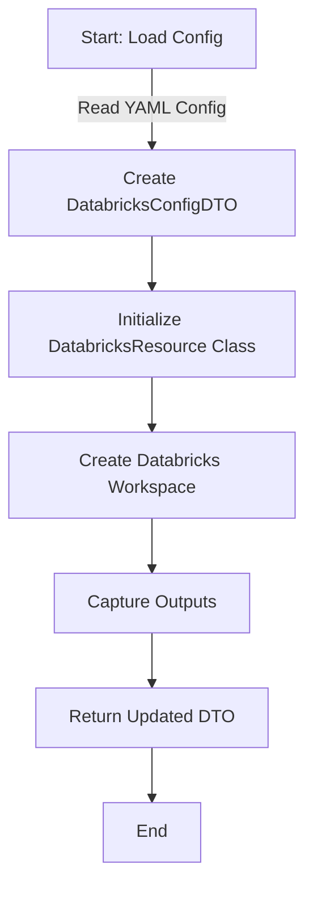

This structure and workflow ensure that the deployment and management of Databricks workspaces are handled efficiently within the Pulumi framework, with clear and organized configuration and deployment management strategies.

## Privatelink.py

Focusing on the `privatelink.py` module, we will address the setup for AWS PrivateLink, which enables private connectivity to services across VPCs. Here's how we'll outline the necessary YAML configuration, update the DTO structure, define the Python class for managing PrivateLink endpoints, and illustrate the process via a flowchart.

### 1. YAML Configuration for PrivateLink

The YAML configuration for PrivateLink could specify endpoints that connect to AWS services or external services privately, including any necessary inputs and desired outputs:

```yaml
privatelink:
  endpoints:
    - service_name: "com.amazonaws.vpce.us-east-1.s3"
      vpc_id: "${vpc_id}"
      subnet_ids: ["${subnet_id}"]
      security_group_ids: ["${sg_id}"]
  outputs:
    endpoint_ids: []
```

### 2. DTO Class Definition for PrivateLink

This section updates the `dto.py` file to include a class for PrivateLink configurations, capturing both input properties and potential outputs.

```python
# dto.py
from dataclasses import dataclass, field
from typing import List, Dict

@dataclass
class PrivateLinkEndpointConfig:
    service_name: str
    vpc_id: str
    subnet_ids: List[str]
    security_group_ids: List[str]

@dataclass
class PrivateLinkConfigDTO:
    endpoints: List[PrivateLinkEndpointConfig]
    outputs: Dict[str, List[str]] = field(default_factory=dict)

    @staticmethod
    def from_dict(config: dict) -> 'PrivateLinkConfigDTO':
        endpoints = [PrivateLinkEndpointConfig(**ep) for ep in config['endpoints']]
        outputs = config.get('outputs', {})
        return PrivateLinkConfigDTO(endpoints=endpoints, outputs=outputs)

```

### 3. PrivateLink Resource Class

This class manages the setup of AWS PrivateLink endpoints using the provided DTO. It handles endpoint creation and captures any relevant output information.

```python
# resources/privatelink.py
import pulumi_aws as aws
from dto import PrivateLinkConfigDTO

class PrivateLinkResource:
    def __init__(self, config: PrivateLinkConfigDTO):
        self.config = config
        self.setup_endpoints()

    def setup_endpoints(self):
        for endpoint in self.config.endpoints:
            pl_endpoint = aws.ec2.VpcEndpoint(
                f"{endpoint.service_name}-endpoint",
                vpc_id=endpoint.vpc_id,
                service_name=endpoint.service_name,
                subnet_ids=endpoint.subnet_ids,
                security_group_ids=endpoint.security_group_ids,
                vpc_endpoint_type="Interface"
            )
            # Store output
            if 'endpoint_ids' not in self.config.outputs:
                self.config.outputs['endpoint_ids'] = []
            self.config.outputs['endpoint_ids'].append(pl_endpoint.id)

    def output_dto(self) -> PrivateLinkConfigDTO:
        return self.config

```

### Mermaid Diagram: Flow of PrivateLink Endpoint Resource Creation

Here's a Mermaid diagram depicting the flow for creating and managing PrivateLink endpoint resources:

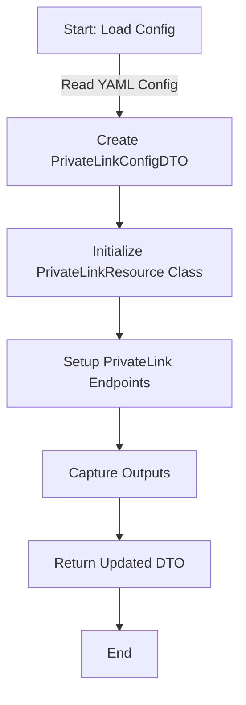

This structure ensures that the deployment and management of PrivateLink endpoints are conducted systematically within the Pulumi framework, enhancing network security and connectivity management.

## KMS.py

Let's dive into configuring and managing AWS Key Management Service (KMS) keys within our infrastructure. This will include defining the necessary YAML configuration, updating the DTO structure, creating the Python class to manage the KMS resources, and visualizing the process through a Mermaid diagram.

### 1. YAML Configuration for KMS

Here's how the KMS configuration might be structured in a `config/*.yml` file. This example includes both input configurations for creating KMS keys and capturing outputs such as the key ARN:

```yaml
kms:
  keys:
    - alias: "alias/myapp-key"
      description: "Encryption key for myapp"
      policy: |
        {
          "Version": "2012-10-17",
          "Statement": [
            {
              "Effect": "Allow",
              "Principal": {"AWS": "arn:aws:iam::123456789012:root"},
              "Action": "kms:*",
              "Resource": "*"
            }
          ]
        }
  outputs:
    key_ids: []
    key_arns: []
```

### 2. DTO Class Definition for KMS

This section will update the `dto.py` file to include a class specifically for KMS configuration, capturing both input properties for creating keys and output values.

```python
# dto.py
from dataclasses import dataclass, field
from typing import List, Dict, Optional

@dataclass
class KMSKeyConfig:
    alias: str
    description: str
    policy: str

@dataclass
class KMSConfigDTO:
    keys: List[KMSKeyConfig]
    outputs: Dict[str, List[str]] = field(default_factory=dict)

    @staticmethod
    def from_dict(config: dict) -> 'KMSConfigDTO':
        keys = [KMSKeyConfig(**key) for key in config['keys']]
        outputs = config.get('outputs', {})
        return KMSConfigDTO(keys=keys, outputs=outputs)

```

### 3. KMS Resource Class

This Python class manages the setup of KMS keys using the provided DTO. It handles key creation and captures any relevant output information.

```python
# resources/kms.py
import pulumi_aws as aws
from dto import KMSConfigDTO

class KMSResource:
    def __init__(self, config: KMSConfigDTO):
        self.config = config
        self.setup_keys()

    def setup_keys(self):
        for key_config in self.config.keys:
            key = aws.kms.Key(
                key_config.alias,
                description=key_config.description,
                policy=key_config.policy
            )
            # Alias for the key
            aws.kms.Alias(
                key_config.alias,
                target_key_id=key.id,
                name=key_config.alias
            )
            # Store output
            if 'key_ids' not in self.config.outputs:
                self.config.outputs['key_ids'] = []
            if 'key_arns' not in self.config.outputs:
                self.config.outputs['key_arns'] = []
            self.config.outputs['key_ids'].append(key.id)
            self.config.outputs['key_arns'].append(key.arn)

    def output_dto(self) -> KMSConfigDTO:
        return self.config

```

### Mermaid Diagram: Flow of KMS Resource Creation

Here’s a Mermaid diagram illustrating the process for creating and managing KMS resources:

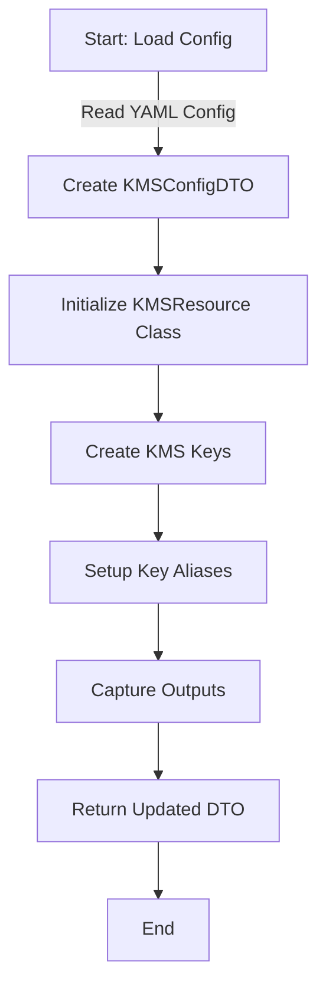

This approach ensures that the management of KMS resources is handled efficiently within the Pulumi framework, maintaining a clear separation of configuration and resource management. It also aligns with best practices in cloud resource provisioning and management.

## Monitoring.py

For the `monitoring.py` module, we'll focus on setting up AWS CloudTrail and CloudWatch for logging and monitoring. This setup will help ensure compliance, security, and operational visibility into the infrastructure.

### 1. YAML Configuration for Monitoring

The YAML configuration for monitoring services such as CloudTrail and CloudWatch can be detailed as follows. This includes configurations for log trails, log groups, and metrics:

```yaml
monitoring:
  cloudtrail:
    name: myapp-trail
    s3_bucket_name: myapp-log-bucket
    include_global_service_events: true
    is_multi_region_trail: true
    enable_log_file_validation: true
  cloudwatch:
    log_group_name: myapp-log-group
    retention_in_days: 90
  outputs:
    trail_arn: ""
    log_group_arn: ""
```

### 2. DTO Class Definition for Monitoring

We'll add a class in the `dto.py` file to handle the configurations and outputs for CloudTrail and CloudWatch:

```python
# dto.py
from dataclasses import dataclass, field
from typing import Optional

@dataclass
class CloudTrailConfig:
    name: str
    s3_bucket_name: str
    include_global_service_events: bool
    is_multi_region_trail: bool
    enable_log_file_validation: bool

@dataclass
class CloudWatchConfig:
    log_group_name: str
    retention_in_days: int

@dataclass
class MonitoringConfigDTO:
    cloudtrail: CloudTrailConfig
    cloudwatch: CloudWatchConfig
    outputs: dict = field(default_factory=dict)

    @staticmethod
    def from_dict(config: dict) -> 'MonitoringConfigDTO':
        return MonitoringConfigDTO(
            cloudtrail=CloudTrailConfig(**config['cloudtrail']),
            cloudwatch=CloudWatchConfig(**config['cloudwatch']),
            outputs=config.get('outputs', {})
        )

```

### 3. Monitoring Resource Class

This Python class will manage the creation of CloudTrail and CloudWatch resources using the provided DTO. It initializes the monitoring resources and captures any relevant output information.

```python
# resources/monitoring.py
import pulumi_aws as aws
from dto import MonitoringConfigDTO

class MonitoringResource:
    def __init__(self, config: MonitoringConfigDTO):
        self.config = config
        self.setup_cloudtrail()
        self.setup_cloudwatch()

    def setup_cloudtrail(self):
        trail = aws.cloudtrail.Trail(
            self.config.cloudtrail.name,
            s3_bucket_name=self.config.cloudtrail.s3_bucket_name,
            include_global_service_events=self.config.cloudtrail.include_global_service_events,
            is_multi_region_trail=self.config.cloudtrail.is_multi_region_trail,
            enable_log_file_validation=self.config.cloudtrail.enable_log_file_validation
        )
        self.config.outputs['trail_arn'] = trail.arn

    def setup_cloudwatch(self):
        log_group = aws.cloudwatch.LogGroup(
            self.config.cloudwatch.log_group_name,
            retention_in_days=self.config.cloudwatch.retention_in_days
        )
        self.config.outputs['log_group_arn'] = log_group.arn

    def output_dto(self) -> MonitoringConfigDTO:
        return self.config

```

### Mermaid Diagram: Flow of Monitoring Resource Creation

Here’s a Mermaid diagram illustrating the process for setting up monitoring resources:

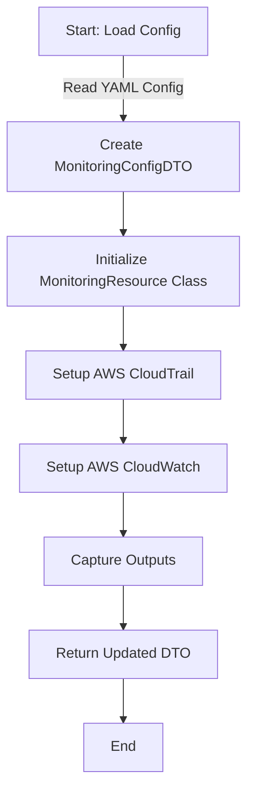

This setup ensures effective monitoring and logging of AWS resources, crucial for security, compliance, and operational management, efficiently handled within the Pulumi framework.

## Bastion.py

For the `bastion.py` module, we'll focus on setting up a Bastion Host (or Jump Box) in an AWS environment, using Pulumi. This host is crucial for securely managing and accessing internal resources in a VPC, especially when public access is restricted.

### 1. YAML Configuration for Bastion Host

Here’s an example of how the Bastion Host configuration might look in a `config/*.yml` file, detailing both input configurations for creating an EC2 instance and outputs:

```yaml
bastion:
  instance:
    name: "bastion-host"
    ami: "ami-0c55b159cbfafe1f0" # Example AMI for Amazon Linux 2
    instance_type: "t3.micro"
    key_name: "my-key-pair"
    vpc_security_group_ids: ["${sg_id}"] # Security group allowing SSH access
    subnet_id: "${public_subnet_id}" # Placed in a public subnet for access
    associate_public_ip_address: true
  outputs:
    instance_id: ""
    public_ip: ""
```

### 2. DTO Class Definition for Bastion Host

We'll add a class in the `dto.py` file to handle the Bastion Host configuration, including input properties for creating an EC2 instance and capturing outputs.

```python
# dto.py
from dataclasses import dataclass, field
from typing import List, Optional

@dataclass
class BastionInstanceConfig:
    name: str
    ami: str
    instance_type: str
    key_name: str
    vpc_security_group_ids: List[str]
    subnet_id: str
    associate_public_ip_address: bool

@dataclass
class BastionConfigDTO:
    instance: BastionInstanceConfig
    outputs: dict = field(default_factory=dict)

    @staticmethod
    def from_dict(config: dict) -> 'BastionConfigDTO':
        return BastionConfigDTO(
            instance=BastionInstanceConfig(**config['instance']),
            outputs=config.get('outputs', {})
        )

```

### 3. Bastion Host Resource Class

This class manages the setup of the Bastion Host using the provided DTO, handling EC2 instance creation and capturing relevant output information.

```python
# resources/bastion.py
import pulumi_aws as aws
from dto import BastionConfigDTO

class BastionResource:
    def __init__(self, config: BastionConfigDTO):
        self.config = config
        self.instance = self.create_instance()

    def create_instance(self):
        instance = aws.ec2.Instance(
            self.config.instance.name,
            ami=self.config.instance.ami,
            instance_type=self.config.instance.instance_type,
            key_name=self.config.instance.key_name,
            vpc_security_group_ids=self.config.instance.vpc_security_group_ids,
            subnet_id=self.config.instance.subnet_id,
            associate_public_ip_address=self.config.instance.associate_public_ip_address,
            tags={"Name": self.config.instance.name}
        )
        # Store outputs
        self.config.outputs['instance_id'] = instance.id
        self.config.outputs['public_ip'] = instance.public_ip

        return instance

    def output_dto(self) -> BastionConfigDTO:
        return self.config

```

### Mermaid Diagram: Flow of Bastion Host Resource Creation

Here's a diagram illustrating the flow for setting up a Bastion Host:

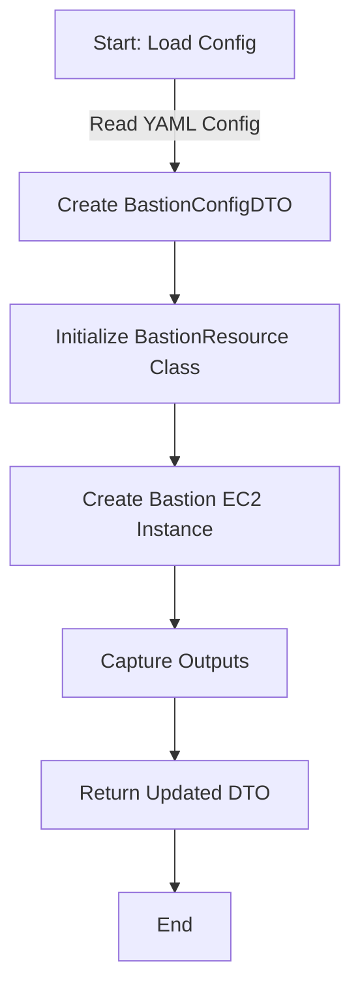

This setup ensures a secure and structured way to manage Bastion Host deployment within the Pulumi framework, maintaining the best practices for secure access and resource management.

## Connectivity.py

For the `connectivity.py` module, we'll focus on setting up VPC Peering and AWS Transit Gateway to facilitate secure and private communication between VPCs without using the public internet. This setup is critical for a robust network architecture in cloud environments.

### 1. YAML Configuration for Connectivity

Here’s an example of how the connectivity configurations might look in a `config/*.yml` file, detailing VPC Peering and Transit Gateway configurations:

```yaml
connectivity:
  vpc_peering:
    - peering_name: "vpc-peering-1"
      source_vpc_id: "${source_vpc_id}"
      target_vpc_id: "${target_vpc_id}"
      auto_accept: true
  transit_gateway:
    - gateway_name: "main-transit-gateway"
      description: "Central hub for network traffic"
      default_route_table_association: "enable"
      default_route_table_propagation: "enable"
      auto_accept_shared_attachments: "enable"
  outputs:
    peering_connection_ids: []
    transit_gateway_ids: []
```

### 2. DTO Class Definition for Connectivity

We'll update the `dto.py` file to include classes for VPC Peering and Transit Gateway configurations, capturing both input properties and output values.

```python
# dto.py
from dataclasses import dataclass, field
from typing import List, Dict

@dataclass
class VPCPeeringConfig:
    peering_name: str
    source_vpc_id: str
    target_vpc_id: str
    auto_accept: bool

@dataclass
class TransitGatewayConfig:
    gateway_name: str
    description: str
    default_route_table_association: str
    default_route_table_propagation: str
    auto_accept_shared_attachments: str

@dataclass
class ConnectivityConfigDTO:
    vpc_peering: List[VPCPeeringConfig]
    transit_gateway: List[TransitGatewayConfig]
    outputs: Dict[str, List[str]] = field(default_factory=dict)

    @staticmethod
    def from_dict(config: dict) -> 'ConnectivityConfigDTO':
        vpc_peering = [VPCPeeringConfig(**peer) for peer in config['vpc_peering']]
        transit_gateway = [TransitGatewayConfig(**gateway) for gateway in config['transit_gateway']]
        outputs = config.get('outputs', {})
        return ConnectivityConfigDTO(vpc_peering=vpc_peering, transit_gateway=transit_gateway, outputs=outputs)

```

### 3. Connectivity Resource Class

This Python class manages the setup of VPC Peering and Transit Gateway using the provided DTO. It handles creation and captures relevant output information.

```python
# resources/connectivity.py
import pulumi_aws as aws
from dto import ConnectivityConfigDTO

class ConnectivityResource:
    def __init__(self, config: ConnectivityConfigDTO):
        self.config = config
        self.setup_vpc_peering()
        self.setup_transit_gateway()

    def setup_vpc_peering(self):
        for peer in self.config.vpc_peering:
            peering_connection = aws.ec2.VpcPeeringConnection(
                peer.peering_name,
                vpc_id=peer.source_vpc_id,
                peer_vpc_id=peer.target_vpc_id,
                auto_accept=peer.auto_accept
            )
            # Store output
            self.config.outputs['peering_connection_ids'].append(peering_connection.id)

    def setup_transit_gateway(self):
        for gateway in self.config.transit_gateway:
            transit_gateway = aws.ec2transitgateway.TransitGateway(
                gateway.gateway_name,
                description=gateway.description,
                auto_accept_shared_attachments=gateway.auto_accept_shared_attachments,
                default_route_table_association=gateway.default_route_table_association,
                default_route_table_propagation=gateway.default_route_table_propagation
            )
            # Store output
            self.config.outputs['transit_gateway_ids'].append(transit_gateway.id)

    def output_dto(self) -> ConnectivityConfigDTO:
        return self.config

```

### Mermaid Diagram: Flow of Connectivity Resource Creation

Here’s a Mermaid diagram illustrating the process for setting up connectivity resources:

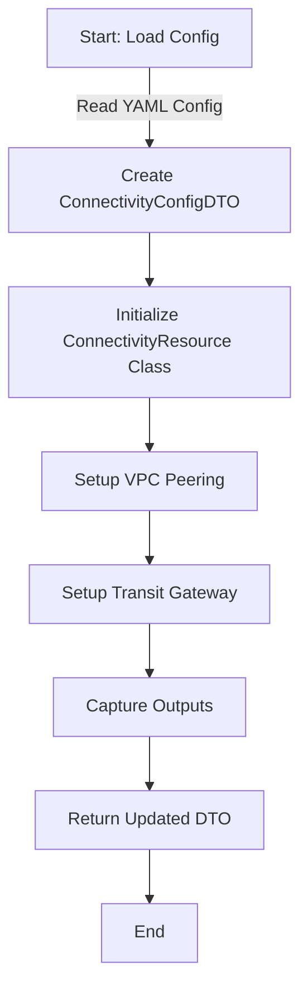

This setup ensures effective and secure network management within an AWS environment, enhancing connectivity while maintaining isolation and security.

## Compliance.py

The `compliance.py` module in your infrastructure project could serve multiple purposes, focusing on ensuring that the cloud environment adheres to compliance and regulatory standards. This might involve configurations and policies to enforce security, data protection standards, and auditing capabilities. Here’s how you could approach integrating compliance features into your Pulumi project:

### Functions of [Compliance.py](http://compliance.py/)

1. **Compliance Checks**:
   - **Automated Compliance Audits**: Ensure that resources comply with internal policies and external regulations (e.g., HIPAA, GDPR, PCI-DSS) by checking configurations against predefined rules or templates.
   - **Tagging Compliance**: Ensure all resources are properly tagged according to organizational policies, which aids in cost tracking, security, and management.
2. **Security Hardening**:
   - **Encryption Enforcements**: Automatically enable encryption on all storage and database services using the most secure methods available.
   - **Security Group Rules Validation**: Ensure no overly permissive security groups or network ACLs are in place.
3. **Logging and Monitoring Setup**:
   - **Centralized Logging**: Set up and verify that all resources send logs to a centralized logging solution for monitoring, troubleshooting, and auditing purposes.
   - **Monitoring Dashboards**: Create and maintain dashboards for real-time monitoring of resources.
4. **Documentation and Reporting**:
   - **Resource Documentation**: Automatically generate documentation for the created resources and their configurations.
   - **Compliance Reports**: Generate compliance reports that can be used for audits and provide evidence of compliance.

### Example YAML Configuration for Compliance

This configuration might specify rules for resource tagging, encryption requirements, and audit settings:

```yaml
compliance:
  enforce_tagging:
    required_tags:
      - Project
      - Owner
  encryption_policies:
    enforce_on:
      - s3
      - ebs
  audit_settings:
    trail_name: "compliance-trail"
    log_bucket: "audit-logs"
  outputs:
    compliance_status: ""
    report_location: ""
```

### Example DTO Class for Compliance

Here’s how you might define the DTO for the compliance configurations:

```python
# dto.py
from dataclasses import dataclass, field
from typing import List, Dict

@dataclass
class TaggingPolicy:
    required_tags: List[str]

@dataclass
class EncryptionPolicy:
    enforce_on: List[str]

@dataclass
class AuditSettings:
    trail_name: str
    log_bucket: str

@dataclass
class ComplianceConfigDTO:
    enforce_tagging: TaggingPolicy
    encryption_policies: EncryptionPolicy
    audit_settings: AuditSettings
    outputs: Dict[str, str] = field(default_factory=dict)

    @staticmethod
    def from_dict(config: dict) -> 'ComplianceConfigDTO':
        return ComplianceConfigDTO(
            enforce_tagging=TaggingPolicy(**config['enforce_tagging']),
            encryption_policies=EncryptionPolicy(**config['encryption_policies']),
            audit_settings=AuditSettings(**config['audit_settings']),
            outputs=config.get('outputs', {})
        )

```

### Compliance Resource Class

This class would manage the setup and enforcement of compliance settings.

```python
# resources/compliance.py
import pulumi
from dto import ComplianceConfigDTO

class ComplianceResource:
    def __init__(self, config: ComplianceConfigDTO):
        self.config = config
        self.ensure_compliance()

    def ensure_compliance(self):
        # Implement logic to enforce tagging
        # Implement logic to enforce encryption
        # Setup audit trails
        self.config.outputs['compliance_status'] = "Compliant"
        self.config.outputs['report_location'] = "s3://audit-logs/report.pdf"

    def output_dto(self) -> ComplianceConfigDTO:
        return self.config

```

### Flow Chart for Compliance Resource Process

A simple diagram might illustrate the process flow for managing compliance:

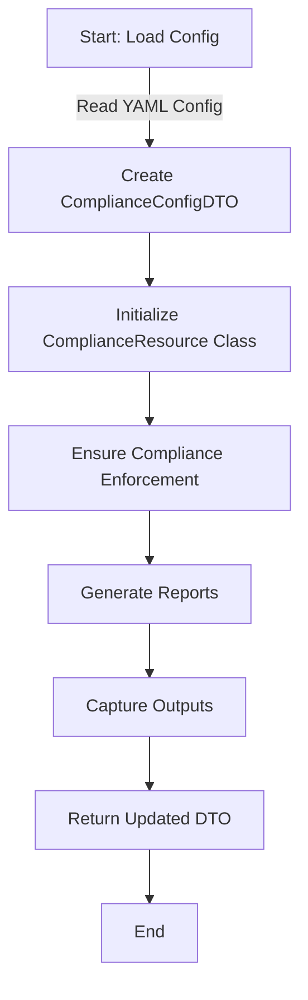

This module effectively ensures that all parts of your infrastructure meet necessary compliance and security standards, vital for maintaining trust and legal conformity.

## main.py and dto.py

Let's structure the `__main__.py` and complete the `dto.py` file to support our Pulumi infrastructure as code (IaC) project. This setup will ensure that all configurations are loaded appropriately, and resources are instantiated based on those configurations.

### `__main__.py`

This is the entry point for the Pulumi project, where resources are created based on the configuration loaded from YAML files.

```python
import pulumi
from dto import ConfigDTO
import yaml
import os

# Import resource classes
from resources.iam import IAMResource
from resources.vpc import VPCResource
from resources.security import SecurityResource
from resources.storage import S3Resource
from resources.databricks import DatabricksResource
from resources.privatelink import PrivateLinkResource
from resources.kms import KMSResource
from resources.monitoring import MonitoringResource
from resources.bastion import BastionResource
from resources.connectivity import ConnectivityResource
from resources.compliance import ComplianceResource

# Load configuration based on the current Pulumi stack
stack = pulumi.get_stack()
config_path = f'config/{stack}.yml'

with open(config_path, 'r') as file:
    config_data = yaml.safe_load(file)

# Create DTOs from configuration
config_dto = ConfigDTO.from_dict(config_data)

# Instantiate resources with DTO
iam_resource = IAMResource(config_dto.iam)
vpc_resource = VPCResource(config_dto.vpc)
security_resource = SecurityResource(config_dto.security)
storage_resource = S3Resource(config_dto.storage)
databricks_resource = DatabricksResource(config_dto.databricks)
privatelink_resource = PrivateLinkResource(config_dto.privatelink)
kms_resource = KMSResource(config_dto.kms)
monitoring_resource = MonitoringResource(config_dto.monitoring)
bastion_resource = BastionResource(config_dto.bastion)
connectivity_resource = ConnectivityResource(config_dto.connectivity)
compliance_resource = ComplianceResource(config_dto.compliance)

# Export any necessary outputs
pulumi.export('iam_outputs', iam_resource.output_dto().outputs)
pulumi.export('vpc_outputs', vpc_resource.output_dto().outputs)
pulumi.export('security_outputs', security_resource.output_dto().outputs)
pulumi.export('storage_outputs', storage_resource.output_dto().outputs)
pulumi.export('databricks_outputs', databricks_resource.output_dto().outputs)
pulumi.export('privatelink_outputs', privatelink_resource.output_dto().outputs)
pulumi.export('kms_outputs', kms_resource.output_dto().outputs)
pulumi.export('monitoring_outputs', monitoring_resource.output_dto().outputs)
pulumi.export('bastion_outputs', bastion_resource.output_dto().outputs)
pulumi.export('connectivity_outputs', connectivity_resource.output_dto().outputs)
pulumi.export('compliance_outputs', compliance_resource.output_dto().outputs)

```

### Complete `dto.py`

This file defines all the DTOs used in the project, incorporating configurations for each type of resource.

```python
from dataclasses import dataclass, field
from typing import List, Dict, Optional

# Define individual configuration classes for each resource type
@dataclass
class IAMConfig:
    roles: List[Dict[str, any]]
    outputs: Dict[str, List[str]] = field(default_factory=dict)

@dataclass
class VPCConfig:
    name: str
    cidr: str
    subnets: List[Dict[str, any]]
    outputs: Dict[str, List[str]] = field(default_factory=dict)

@dataclass
class SecurityConfig:
    security_groups: List[Dict[str, any]]
    outputs: Dict[str, List[str]] = field(default_factory=dict)

@dataclass
class StorageConfig:
    buckets: List[Dict[str, any]]
    outputs: Dict[str, List[str]] = field(default_factory=dict)

@dataclass
class DatabricksConfig:
    workspace: Dict[str, any]
    outputs: Dict[str, List[str]] = field(default_factory=dict)

@dataclass
class PrivateLinkConfig:
    endpoints: List[Dict[str, any]]
    outputs: Dict[str, List[str]] = field(default_factory=dict)

@dataclass
class KMSConfig:
    keys: List[Dict[str, any]]
    outputs: Dict[str, List[str]] = field(default_factory=dict)

@dataclass
class MonitoringConfig:
    cloudtrail: Dict[str, any]
    cloudwatch: Dict[str, any]
    outputs: Dict[str, List[str]] = field(default_factory=dict)

@dataclass
class BastionConfig:
    instance: Dict[str, any]
    outputs: Dict[str, List[str]] = field(default_factory=dict)

@dataclass
class ConnectivityConfig:
    peering_connections: List[Dict[str, any]]
    transit_gateways: List[Dict[str, any]]
    outputs: Dict[str, List[str]] = field

(default_factory=dict)

@dataclass
class ComplianceConfig:
    policies: Dict[str, any]
    outputs: Dict[str, List[str]] = field(default_factory=dict)

# Unified DTO class for entire configuration
@dataclass
class ConfigDTO:
    iam: IAMConfig
    vpc: VPCConfig
    security: SecurityConfig
    storage: StorageConfig
    databricks: DatabricksConfig
    privatelink: PrivateLinkConfig
    kms: KMSConfig
    monitoring: MonitoringConfig
    bastion: BastionConfig
    connectivity: ConnectivityConfig
    compliance: ComplianceConfig

    @staticmethod
    def from_dict(config: dict) -> 'ConfigDTO':
        return ConfigDTO(
            iam=IAMConfig(**config['iam']),
            vpc=VPCConfig(**config['vpc']),
            security=SecurityConfig(**config['security']),
            storage=StorageConfig(**config['storage']),
            databricks=DatabricksConfig(**config['databricks']),
            privatelink=PrivateLinkConfig(**config['privatelink']),
            kms=KMSConfig(**config['kms']),
            monitoring=MonitoringConfig(**config['monitoring']),
            bastion=BastionConfig(**config['bastion']),
            connectivity=ConnectivityConfig(**config['connectivity']),
            compliance=ComplianceConfig(**config['compliance'])
        )

```

This comprehensive setup encapsulates the full spectrum of infrastructure components, ensuring robust configuration management and streamlined resource deployment.

---

The following is a newer, minimal deployment to test out.

To create a Pulumi script for deploying a Databricks workspace on AWS with the specified highly available architecture, we'll need to set up multiple components including VPC, subnets, security groups, NAT gateway, S3 bucket, IAM roles, and Databricks clusters. Here's a comprehensive Pulumi script in Python that covers all the specified requirements:

```python
import pulumi
import pulumi_aws as aws
import pulumi_databricks as databricks
import pulumi_random as random

# Configuration
config = pulumi.Config()
aws_region = config.require("awsRegion")
databricks_account_id = config.require("databricksAccountId")
cross_account_arn = config.require("crossAccountArn")
root_bucket_name = config.require("rootBucketName")
key_arn = config.require("keyArn")

# VPC setup
vpc = aws.ec2.Vpc("vpc",
    cidr_block="10.0.0.0/16",
    enable_dns_support=True,
    enable_dns_hostnames=True,
    tags={"Name": "databricks-vpc"}
)

# Subnets
public_subnet1 = aws.ec2.Subnet("public_subnet1",
    vpc_id=vpc.id,
    cidr_block="10.0.1.0/24",
    availability_zone=f"{aws_region}a",
    map_public_ip_on_launch=True,
    tags={"Name": "public-subnet-1"}
)

public_subnet2 = aws.ec2.Subnet("public_subnet2",
    vpc_id=vpc.id,
    cidr_block="10.0.2.0/24",
    availability_zone=f"{aws_region}b",
    map_public_ip_on_launch=True,
    tags={"Name": "public-subnet-2"}
)

public_subnet3 = aws.ec2.Subnet("public_subnet3",
    vpc_id=vpc.id,
    cidr_block="10.0.3.0/24",
    availability_zone=f"{aws_region}c",
    map_public_ip_on_launch=True,
    tags={"Name": "public-subnet-3"}
)

private_subnet1 = aws.ec2.Subnet("private_subnet1",
    vpc_id=vpc.id,
    cidr_block="10.0.4.0/24",
    availability_zone=f"{aws_region}a",
    tags={"Name": "private-subnet-1"}
)

private_subnet2 = aws.ec2.Subnet("private_subnet2",
    vpc_id=vpc.id,
    cidr_block="10.0.5.0/24",
    availability_zone=f"{aws_region}b",
    tags={"Name": "private-subnet-2"}
)

private_subnet3 = aws.ec2.Subnet("private_subnet3",
    vpc_id=vpc.id,
    cidr_block="10.0.6.0/24",
    availability_zone=f"{aws_region}c",
    tags={"Name": "private-subnet-3"}
)

# Internet Gateway
igw = aws.ec2.InternetGateway("igw",
    vpc_id=vpc.id,
    tags={"Name": "databricks-igw"}
)

# NAT Gateway
eip = aws.ec2.Eip("eip",
    vpc=True,
    tags={"Name": "databricks-eip"}
)

nat_gateway = aws.ec2.NatGateway("nat_gateway",
    allocation_id=eip.id,
    subnet_id=public_subnet1.id,
    tags={"Name": "databricks-nat-gateway"}
)

# Route Tables
public_route_table = aws.ec2.RouteTable("public_route_table",
    vpc_id=vpc.id,
    routes=[{
        "cidr_block": "0.0.0.0/0",
        "gateway_id": igw.id
    }],
    tags={"Name": "public-route-table"}
)

private_route_table = aws.ec2.RouteTable("private_route_table",
    vpc_id=vpc.id,
    routes=[{
        "cidr_block": "0.0.0.0/0",
        "nat_gateway_id": nat_gateway.id
    }],
    tags={"Name": "private-route-table"}
)

# Associate Route Tables
aws.ec2.RouteTableAssociation("public_route_table_association1",
    subnet_id=public_subnet1.id,
    route_table_id=public_route_table.id
)

aws.ec2.RouteTableAssociation("public_route_table_association2",
    subnet_id=public_subnet2.id,
    route_table_id=public_route_table.id
)

aws.ec2.RouteTableAssociation("public_route_table_association3",
    subnet_id=public_subnet3.id,
    route_table_id=public_route_table.id
)

aws.ec2.RouteTableAssociation("private_route_table_association1",
    subnet_id=private_subnet1.id,
    route_table_id=private_route_table.id
)

aws.ec2.RouteTableAssociation("private_route_table_association2",
    subnet_id=private_subnet2.id,
    route_table_id=private_route_table.id
)

aws.ec2.RouteTableAssociation("private_route_table_association3",
    subnet_id=private_subnet3.id,
    route_table_id=private_route_table.id
)

# Security Group
security_group = aws.ec2.SecurityGroup("security_group",
    vpc_id=vpc.id,
    description="Allow all inbound traffic",
    ingress=[{
        "protocol": "-1",
        "from_port": 0,
        "to_port": 0,
        "cidr_blocks": ["0.0.0.0/0"]
    }],
    egress=[{
        "protocol": "-1",
        "from_port": 0,
        "to_port": 0,
        "cidr_blocks": ["0.0.0.0/0"]
    }],
    tags={"Name": "databricks-sg"}
)

# S3 Bucket
s3_bucket = aws.s3.Bucket("s3_bucket",
    bucket=root_bucket_name,
    acl="private",
    tags={"Name": "databricks-root-bucket"}
)

# IAM Role for Cross-Account
assume_role_policy = databricks.get_aws_assume_role_policy(external_id=databricks_account_id).json

cross_account_role = aws.iam.Role("cross_account_role",
    assume_role_policy=assume_role_policy,
    tags={"Name": "databricks-cross-account-role"}
)

cross_account_role_policy = aws.iam.RolePolicy("cross_account_role_policy",
    role=cross_account_role.id,
    policy=databricks.get_aws_cross_account_policy().json
)

# Databricks Workspace
mws_credentials = databricks.MwsCredentials("mws_credentials",
    account_id=databricks_account_id,
    credentials_name="databricks-creds",
    role_arn=cross_account_role.arn
)

mws_storage_configuration = databricks.MwsStorageConfigurations("mws_storage_configuration",
    account_id=databricks_account_id,
    storage_configuration_name="databricks-storage",
    bucket_name=s3_bucket.id
)

mws_networks = databricks.MwsNetworks("mws_networks",
    account_id=databricks_account_id,
    network_name="databricks-network",
    vpc_id=vpc.id,
    subnet_ids=[private_subnet1.id, private_subnet2.id, private_subnet3.id],
    security_group_ids=[security_group.id]
)

databricks_workspace = databricks.MwsWorkspaces("databricks_workspace",
    account_id=databricks_account_id,
    workspace_name="databricks-workspace",
    aws_region=aws_region,
    credentials_id=mws_credentials.credentials_id,
    storage_configuration_id=mws_storage_configuration.storage_configuration_id,
    network_id=mws_networks.network_id,
    token=databricks.MwsWorkspacesTokenArgs(),
    custom_tags={
        "Environment": "Production"
    }
)

# Outputs
pulumi.export("databricksWorkspaceUrl", databricks_workspace.workspace_url)
pulumi.export("s3BucketName", s3_bucket.id)
```

### Explanation:

1. **VPC and Subnets:** Creates a VPC and public/private subnets across three availability zones.
2. **NAT Gateway:** Sets up a NAT Gateway for internet access for resources in private subnets.
3. **Security Group:** Configures a security group for the Databricks clusters.
4. **S3 Bucket:** Creates an S3 bucket for storing Databricks artifacts.
5. **IAM Role:** Sets up an IAM role with cross-account access.
6. **Databricks Workspace:** Configures Databricks workspace with the required network and storage settings.
7. **Outputs:** Exports the URL of the Databricks workspace and the name of the S3 bucket.

Ensure you provide the necessary configuration values such as `awsRegion`, `databricksAccountId`, `crossAccountArn`, `rootBucketName`, and `keyArn` through Pulumi config or environment variables.
